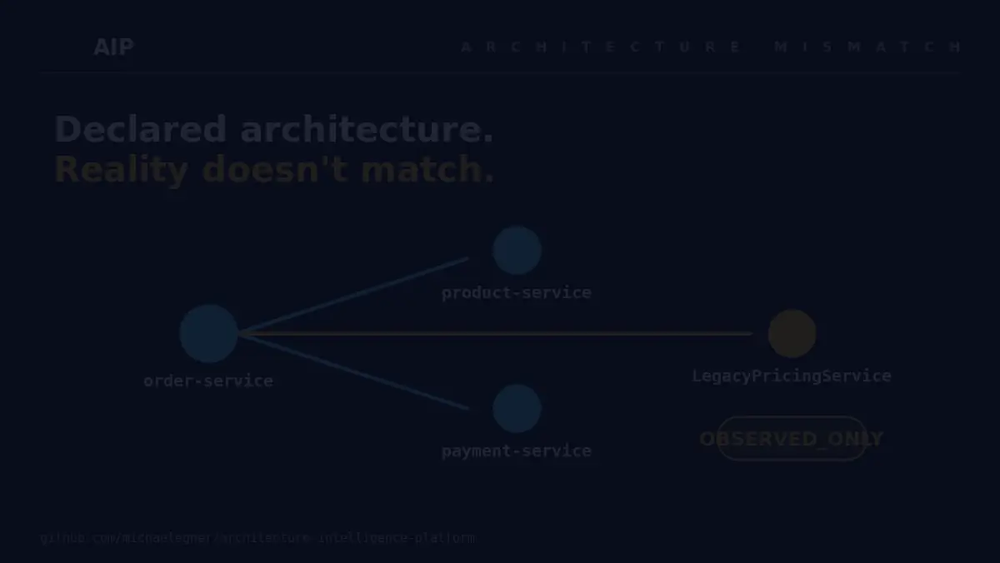

# Architecture Intelligence Platform

[](https://github.com/michaelegner/architecture-intelligence-platform/actions/workflows/ci.yml)
[](LICENSE)

## Agents should reason about architecture — not reconstruct it.

AIP gives coding agents evidence-qualified architecture context.

It reconciles declared API contracts with observed runtime behavior so an agent can distinguish:

- dependencies that are declared and observed;
- dependencies seen in production but documented nowhere;
- declared relationships not observed in the selected runtime window;
- facts AIP cannot safely establish.

Every answer is snapshot-bound and traceable to evidence. The agent-facing tools are read-only.

**[Run the 5-Minute Demo](#see-it-in-five-minutes) · [MCP Tools](#mcp-tools) · [How It Works](#how-aip-works)**



**`LegacyPricingService` was never declared. AIP observed the dependency at runtime as
`OBSERVED_ONLY` and traces the claim back to its OpenTelemetry evidence.**

⭐ Star AIP if evidence-qualified architecture context for coding agents is a problem you want
solved.

**[Video Walkthrough](https://www.linkedin.com/feed/update/urn:li:activity:7503338966553882625/) ·
[Evaluation](#evaluation) · [Boundaries](#boundaries) · [Documentation](#documentation) ·
[Research Landscape](docs/landscape.md)**

## See It in Five Minutes

Requires Docker (with Compose), `curl` and `jq`. **No LLM API key** — nothing on this path calls a
model:

```bash
git clone https://github.com/michaelegner/architecture-intelligence-platform.git
cd architecture-intelligence-platform
cp .env.example .env
examples/runtime-demo/mcp-demo.sh
```

The script starts AIP + Neo4j + an OTel Collector, imports the bundled example architecture, seeds
one timestamp-frozen batch of runtime telemetry, then drives `tools/list` →
`get_architecture_drift` → `get_evidence` over plain HTTP/JSON-RPC — the same direct `2026-07-28`
request path a compatible MCP client would take.

Asking `get_architecture_drift` about `order-service` returns two findings:

| Dependency | Qualification | What it means |
|---|---|---|
| `LegacyPricingService` | `OBSERVED_ONLY` | A runtime dependency observed in the seeded telemetry that **nothing declares** |
| `unused-q` | `NOT_OBSERVED_IN_WINDOW` | Declared in `asyncapi.yaml`, not seen in this window — deliberately *not* reported as "unused" or "dead" |

`ProductService` and `PaymentService` (via `payment-q`) are `CONFIRMED` — declared **and**
observed — and correctly don't appear at all: drift returns discrepancies, never matches.
`get_service_dependencies` is the tool that lists all four. Alongside the two claims the answer
carries a `limitations` entry: AIP declining to name a consumer for `unused-q` that it cannot
evidence. Each claim's `evidence_refs` then resolve through `get_evidence`, at the same
`snapshot_id`, to the `asyncapi.yaml` that declared one and the OpenTelemetry window that observed
the other.

<details>
<summary><b>The full JSON both calls return</b></summary>

`get_architecture_drift` for `order-service`, exactly as the demo prints it — its `jq` flattens
`snapshot.snapshot_id` and keeps the fields that matter here, rather than showing the full envelope:

```json
{
  "snapshot_id": "aip:snapshot:v1:685a34157b6842b00d7130b8490df63060c3d80871c2ed6f56cd9206e62342d8",
  "outcome": "PARTIAL",
  "limitations": [
    {
      "code": "UNRESOLVED_IDENTITY",
      "message": "queue:unused-q has no single evidenced consumer service; retained as the direct queue target rather than guessed.",
      "claim_ids": ["aip:claim:v1:ca0dd73ba391552edd6d2cc06cddd919a8af97f362cdb47392e78325219fd612"]
    }
  ],
  "claims": [
    {
      "dependency": "unused-q",
      "via": "unused-q",
      "qualification": "NOT_OBSERVED_IN_WINDOW",
      "evidence_refs": ["evidence:asyncapi:order-service"]
    },
    {
      "dependency": "LegacyPricingService",
      "via": "GET /pricing/{sku}",
      "qualification": "OBSERVED_ONLY",
      "evidence_refs": ["evidence:otel:demo:2026-08-26:bfae54276215"]
    }
  ]
}
```

Feeding those `evidence_refs` back into `get_evidence` at the **same** `snapshot_id` returns the
provenance behind each claim:

```json
[
  {
    "id": "evidence:asyncapi:order-service",
    "evidence_type": "DECLARED",
    "source_type": "ASYNCAPI",
    "source_locator": "examples/order-service/asyncapi.yaml"
  },
  {
    "id": "evidence:otel:demo:2026-08-26:bfae54276215",
    "evidence_type": "OBSERVED",
    "source_type": "OPENTELEMETRY",
    "source_locator": "opentelemetry"
  }
]
```

</details>

Because every seeded span is frozen rather than clock-derived, two clean runs produce the same
qualifications and the same `snapshot_id`. Run `examples/runtime-demo/mcp-demo.sh --down` to tear it
back down. For the step-by-step version — every `curl` spelled out, with what each answer means —
see [`examples/runtime-demo/hero-demo.md`](examples/runtime-demo/hero-demo.md).

## What You Can Do With It

**Find dependencies nobody wrote down.** Real traffic reveals calls that exist in no spec, manifest
or diagram. AIP surfaces them as `OBSERVED_ONLY`, with the observation window that saw them —
`OrderService -> LegacyPricingService` in the demo above.

**Check whether the architecture you declared is the one that's running.** Drift is reported per
dependency and in both directions — declared but not observed, observed but never declared — each
qualified rather than asserted.

**Give a coding agent context it can cite.** Three read-only MCP tools hand an agent direct
dependencies, drift and provenance bound to one graph snapshot, so it can tell a fact from a guess
— and so it can never write to the model it is reading from.

## Connect AIP to Your Coding Agent

Prepare the deterministic demo without running the scripted MCP calls yourself:

```bash
examples/runtime-demo/mcp-demo.sh --serve
```

AIP is now available at `http://localhost:8000/mcp`. Configure a coding-agent client using the
examples below — configuration syntax is verified against each client's current official docs;
release-qualified client/platform support is a separate, later claim (see
[`examples/mcp-clients/`](examples/mcp-clients/README.md)).

### Codex CLI

```bash
codex mcp add aip --url http://localhost:8000/mcp
```

### Claude Code

```bash
claude mcp add --transport http --scope local aip http://localhost:8000/mcp
```

<details>
<summary>Cursor / VS Code</summary>

**Cursor** — `.cursor/mcp.json`:

```json
{ "mcpServers": { "aip": { "url": "http://localhost:8000/mcp" } } }
```

**VS Code** — `.vscode/mcp.json`:

```json
{ "servers": { "aip": { "type": "http", "url": "http://localhost:8000/mcp" } } }
```

</details>

Then ask:

> Use AIP to find architecture drift for service:order-service in the demo environment between
> 2026-08-26T00:00:00Z and 2026-08-27T00:00:00Z. For every finding, explain its qualification and
> resolve its evidence using the same snapshot. Do not infer facts AIP does not establish.

Expected AIP findings:

- `LegacyPricingService` — `OBSERVED_ONLY` (observed at runtime, never declared)
- `unused-q` — `NOT_OBSERVED_IN_WINDOW` (declared, not seen in this window — never "unused" or "dead")

These instructions target **locally running** clients — a hosted/cloud agent usually can't reach
your `localhost`. `/mcp` has no public-internet authentication in `v0.4.2`; keep it local or on a
trusted network. AIP itself needs no LLM API key for this path; your client may still need its own.

[Detailed per-client setup, verification sources, and cleanup instructions →](examples/mcp-clients/README.md)

## Why?

An agent changing a service needs to know what that service actually talks to. Today it often gets
that from two problematic sources: architecture documentation that may have drifted from reality,
and plausible inference from whatever code happened to fit in the context window. Both sound
equally confident, and neither lets the agent tell a fact from a guess.

AIP answers that question from evidence that already exists and is already maintained as part of
normal development — OpenAPI/AsyncAPI specs, a minimal manifest for the one thing they can't express
(who calls what), and, optionally, real OpenTelemetry traffic. Dependency and drift answers state
which evidence supports each claim, whether runtime observation agrees with what was declared, and
what AIP could *not* establish: a dependency that was never observed is reported as not observed,
never as absent, and an unresolved identity is never guessed. Evidence drill-down resolves those
evidence references at the same snapshot without creating new architecture claims.

> AIP may help agents reason about architecture, but an agent must never become the source of
> architectural truth. — [`ROADMAP.md`](ROADMAP.md)'s v0.4 principle

## MCP Tools

AIP exposes the validated architecture model at `/mcp` (MCP protocol `2026-07-28`) as exactly
three **read-only** tools:

| Tool | Answers |
|---|---|
| `get_service_dependencies` | What does this service directly depend on, and is each dependency confirmed by runtime observation? |
| `get_architecture_drift` | Which of those direct dependencies disagree with what was declared — observed but undocumented, or declared but not observed in this window? |
| `get_evidence` | What is the actual provenance behind those claims — which spec file, manifest, or observation window? |

All three perform zero graph writes and need no LLM API key — the whole surface is deterministic —
and none of them will invent, guess, or upgrade an unresolved fact: insufficient evidence comes back
as a `limitations` entry, never as silence.

What each answer contains, what it is bound to, and what the surface deliberately does *not* do:
[Boundaries](#boundaries) below. Full reference, including the exact JSON-RPC call shape:
[`docs/mcp.md`](docs/mcp.md).

## Quick Start

To run the whole platform (REST API, Service Explorer, MCP endpoint) rather than just the demo:

```bash
cp .env.example .env
docker compose up
```

`.env.example`'s `NEO4J_PASSWORD` is a fixed local-only default (`change-me-local`) — fine for
trying this out, never for anything reachable outside your machine.

Then open <http://localhost:8000>. `config.yaml` already points at this repo's `examples/` fixture
services, so `POST /api/import` works immediately against them. See
[`docs/development.md`](docs/development.md) for running locally without Docker, the test suite, and
linting.

## How AIP Works

Evidence in, qualified architecture facts out:

```text
OpenAPI · AsyncAPI · architecture.yaml   (declared)
OpenTelemetry traces                     (observed)
        -> canonical model -> evidence-backed graph -> qualified claims -> MCP tools / REST / UI
```

Hand-maintained architecture documentation drifts because nothing forces it to agree with the
system. AIP never stores an architecture fact without the evidence that produced it, so declared and
observed signals stay distinguishable instead of collapsing into one undifferentiated "truth".

### Declared vs observed

Every relation in the graph carries evidence, and its evidence can be `DECLARED` (from a spec/
manifest), `OBSERVED` (from real telemetry), or both. That's what turns into a status:

| Status | Meaning |
|---|---|
| `CONFIRMED` | Declared **and** observed |
| `OBSERVED_ONLY` | Observed, but never declared anywhere — an undocumented real dependency |
| `NOT_OBSERVED_IN_WINDOW` | Declared, but not seen in this window — never "obsolete"/"unused"/"dead", just not observed *yet or here* |

Removing a stale declaration never deletes a relation that still has observed evidence — it degrades
`CONFIRMED` to `OBSERVED_ONLY` instead. See [`docs/graph-model.md`](docs/graph-model.md) for the
exact invariant this guarantees and why it matters. The dependency and drift MCP tools above return
exactly these qualifications; nothing is upgraded or smoothed over on the way out.

### Ingestion

A modular Python monolith (a single FastAPI process); Neo4j is the only external persistent
dependency. Ingestion is a strictly staged pipeline — `scan -> parse -> source-validate -> map to
canonical model -> canonical-validate -> reconcile/diff -> transactional graph write` — where a
service's import either fully succeeds or is entirely discarded, never left partial. Source adapters
never write to Neo4j directly; they all map into one shared Canonical Model first. Full details,
including the graph/evidence model and every API route: [`docs/architecture.md`](docs/architecture.md).

### Deterministic analyses

Five fixed, parameterized Cypher analyses over declared architecture (queue senders/consumers,
orphan queues, mixed-architecture blast radius) plus five over declared-vs-observed runtime data
(what was actually observed, what's confirmed, what's observed-only, what's declared-only, and
per-service telemetry coverage). None of these involve the LLM — see
[`docs/analyses.md`](docs/analyses.md) for the full list and what each one answers.

## Core Capabilities

- Evidence-qualified service dependencies and architecture drift, via three read-only MCP tools
- OpenAPI, AsyncAPI and OpenTelemetry evidence, reconciled into one graph
- Snapshot-bound provenance — every claim traces back to the spec file, manifest, or observation
  window that produced it
- Deterministic declared-vs-observed reconciliation, with cross-batch OTel correlation
- Conservative handling of missing evidence and unresolved identity — never guessed, never silently
  dropped
- Neo4j-backed architecture model with an optional Service Explorer UI

[See the architecture and capability documentation →](docs/architecture.md) ·
[Correlation modes →](docs/opentelemetry.md)

## Example

The bundled `examples/` fixture is a small, fully synthetic four-service landscape:


`unused-q` (a sender with no consumer) and `unknown-producer-q` (a consumer with no known sender) are
included specifically to exercise the orphan-queue analyses. `POST /api/import` loads all of it in
one call.

## Evaluation

AIP is evaluated against independently authored ground truth — never against expectations
generated from AIP's own output — with deterministic PASS/FAIL:

- 10 deterministic scenarios over declared/observed relation facts
- 23 `ArchitectureAnswer` scenarios across all three MCP tools
- Two clean `ArchitectureAnswer` runs are semantically identical; the hero demo's
  `structuredContent` is byte-identical across repeated clean runs
- Real-system validation against Quarkus Super Heroes and Apache Airflow

```bash
uv run python -m evaluation run       # ten relation-fact scenarios
uv run python -m evaluation answers   # 23 ArchitectureAnswer scenarios
```

No LLM provider key is required — neither suite touches the natural-language query layer. See
[`evaluation/README.md`](evaluation/README.md) for the full scenario lists, ground-truth formats,
and failure-report examples.

### Tested against real systems

AIP's model was also challenged against two systems it wasn't designed for: Quarkus Super Heroes
and Apache Airflow. The important result wasn't that AIP "discovered everything" — it was that
unsupported and unresolved cases stayed explicit instead of being converted into plausible
architecture facts. See
[`docs/real-world-validation/README.md`](docs/real-world-validation/README.md) for the
ground-truth independence rule, dossier structure, and per-system findings.

<details>
<summary>Implementation details: exact result files, historical artifacts, SHA references</summary>

`answers` compares the complete `ArchitectureAnswer` — claims, evidence references, snapshot and
observation-context identity, limitations — against literal frozen expectations across all three
tools (`get_service_dependencies`, `get_architecture_drift`, `get_evidence`) and emits a
machine-readable JSON result to
`evaluation/architecture_answers/results/architecture-answers-evaluation-result.json`. The original
I1-only artifact, `evaluation/architecture_answers/results/i1-evaluation-result.json`, is kept as
the immutable historical record `docs/specifications/0.4.0/i1-completion-record.md` cites by
SHA-256 — it is no longer written by `answers`, only the generalized file is.

</details>

## Runtime Evidence with OpenTelemetry

**AIP consumes OTLP traces as an additional telemetry consumer, not a replacement for your
observability backend.** It must never be the only thing an OTel Collector forwards to, and its own
availability must never affect an application's normal observability:


The bundled runtime demo generates continuous synthetic traffic and shows `CONFIRMED`,
`OBSERVED_ONLY` and `NOT_OBSERVED_IN_WINDOW` relationships fill in live, in both the API and the
Service Explorer:


[OpenTelemetry integration →](docs/opentelemetry.md) ·
[Runtime demo walkthrough →](examples/runtime-demo/README.md)

### Optional human query interface

`POST /api/query` also answers plain-language questions for interactive exploration — routed to an
existing deterministic analysis where possible, or otherwise answered with LLM-generated Cypher
that must pass a strict read-only allowlist validator before it ever touches Neo4j. The LLM never
holds write credentials and its Cypher is always shown back for traceability. Entirely optional —
the platform works with no LLM provider configured, and no MCP tool depends on it. See
[`docs/semantic-validation.md`](docs/semantic-validation.md).

## Boundaries

What the three MCP tools return, and what they deliberately don't.

**One envelope.** Every tool returns the same `ArchitectureAnswer` (`schema_version`, `producer`,
`tool`, `outcome`, `snapshot`, `observation_context`, `data`, `claims`, `evidence_refs`,
`limitations`), validated against a closed, published JSON Schema. Dependency and drift answers
populate `claims`/`evidence_refs`, while `get_evidence` resolves evidence records into `data` and
intentionally leaves those top-level arrays empty.

**Current state, not history.** Every answer is bound to one stable graph snapshot identity — a
fingerprint of the *current* graph state, so two related answers can be proven to refer to the same
identified graph state. There is no historical or point-in-time query surface, and a `snapshot_id`
that is no longer the current one is refused with a `SNAPSHOT_NOT_AVAILABLE` limitation rather than
answered from stale data.

**Explicit observation context.** The runtime-sensitive dependency and drift tools carry an
environment and time window on every answer, while `get_evidence` is intentionally
observation-context-free and requires an explicit `snapshot_id`.

**Direct dependencies only.** One hop — no transitive traversal, and no generic Cypher or graph
query surface behind the tools.

**One path, two connection modes.** `/mcp` speaks the strict `2026-07-28` per-request envelope as
before, and also accepts standard negotiated MCP client initialization on that same path — both
expose identical architecture semantics (see [`docs/mcp.md`](docs/mcp.md)), and a request that is
neither a valid direct call nor valid negotiated traffic is rejected rather than silently downgraded
to whichever path is more permissive.

**Local or trusted network.** As with the rest of AIP, `/mcp` is built for a local or
trusted-network posture; it is not hardened for direct public-internet exposure — see
[`docs/security-model.md`](docs/security-model.md).

## Documentation

- [`docs/mcp.md`](docs/mcp.md) — the three read-only MCP tools for AI agents, and a runnable
  hero-demo walkthrough
- [`docs/architecture.md`](docs/architecture.md) — pipeline, API surface
- [`docs/canonical-model.md`](docs/canonical-model.md) — entities and deterministic ids
- [`docs/graph-model.md`](docs/graph-model.md) — relations, fact/evidence invariants, observed `PROVIDES`
- [`docs/evidence.md`](docs/evidence.md) — provenance, the `Evidence` node, correlation modes
- [`docs/ingestion.md`](docs/ingestion.md) — the three declared source adapters
- [`docs/analyses.md`](docs/analyses.md) — A1-A5 and O1-O5
- [`docs/semantic-validation.md`](docs/semantic-validation.md) — the NL query pipeline
- [`docs/opentelemetry.md`](docs/opentelemetry.md) — runtime observation, attribute allowlist, coverage
- [`evaluation/README.md`](evaluation/README.md) — the deterministic evaluation suite: scenarios,
  ground-truth format, running it, and reading a failure report
- [`real_world_validation/README.md`](real_world_validation/README.md) and
  [`docs/real-world-validation/README.md`](docs/real-world-validation/README.md) — the v0.3
  real-world validation contract: finding vocabulary, `expected.yaml` shape, dossier structure
- [`docs/configuration.md`](docs/configuration.md) — every setting and its default
- [`docs/security-model.md`](docs/security-model.md) — trust boundaries
- [`docs/development.md`](docs/development.md) — local dev, tests, linting
- [`docs/adapter-development.md`](docs/adapter-development.md) — extending AIP with a new source
- [`docs/architecture-review-0.4.0.md`](docs/architecture-review-0.4.0.md) — post-`v0.4.0`
  architecture review: what held up, four structural findings, measured read cost
- [`docs/adr/`](docs/adr/) — Architecture Decision Records: why Neo4j, why a Canonical Model, why
  the LLM is read-only and never a source of truth, and more
- [`docs/specifications/`](docs/specifications/) — the original design specifications, as a
  traceable history of how the platform got here
- [`docs/landscape.md`](docs/landscape.md) — research landscape: formal foundations, adjacent
  platforms, agent context, architectural intent, governance, and verification
- [`ROADMAP.md`](ROADMAP.md) / [`CHANGELOG.md`](CHANGELOG.md) — where this is headed, and what's
  shipped so far

## Contributing

See [`CONTRIBUTING.md`](CONTRIBUTING.md) for development setup, test/lint/format commands, and the
adapter contribution guide. Questions and ideas go in [Discussions](../../discussions); bugs and
feature requests use the issue templates. Security vulnerabilities should never be reported as
public issues — see [`SECURITY.md`](SECURITY.md). This project follows the
[Contributor Covenant](CODE_OF_CONDUCT.md).

## Project Status

Latest release:
[`v0.4.1`](https://github.com/michaelegner/architecture-intelligence-platform/releases/tag/v0.4.1)
— **Semantic Hardening for Broader Discovery**.

Pre-1.0: the REST/MCP surface, Graph Schema, Canonical Model, Adapter SPI and configuration format
may still change on a minor version bump. Every release ships a published-artifact verification —
[`docs/release-validation/v0.4.1-post-release-verification.md`](docs/release-validation/v0.4.1-post-release-verification.md)
is the most recent. See [`CHANGELOG.md`](CHANGELOG.md) for what shipped in each release and
[`ROADMAP.md`](ROADMAP.md) for what's next — v0.5 (Broader Architecture Discovery).

## License

Licensed under the Apache License, Version 2.0.
See [LICENSE](LICENSE). Third-party dependency licenses: [THIRD_PARTY_LICENSES.md](THIRD_PARTY_LICENSES.md).
